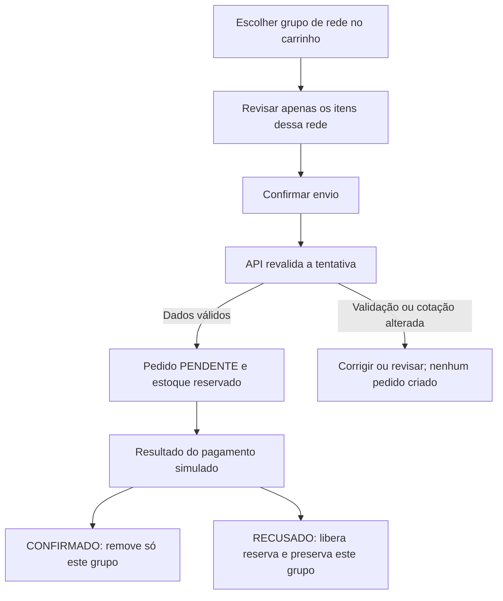
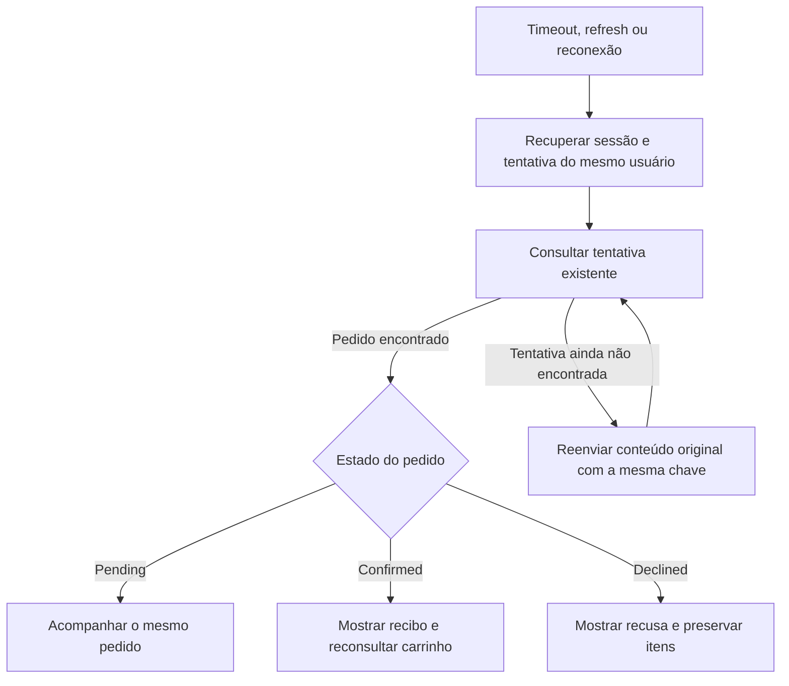
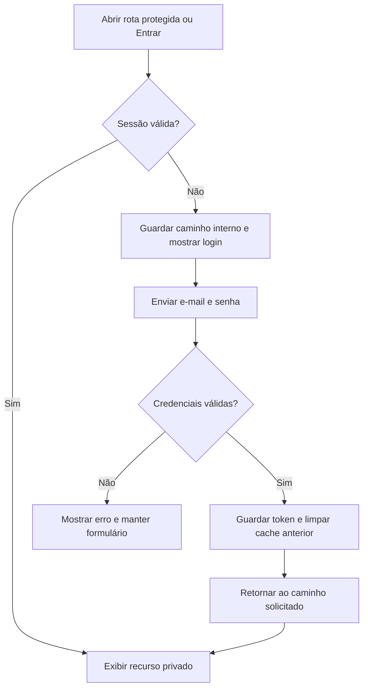
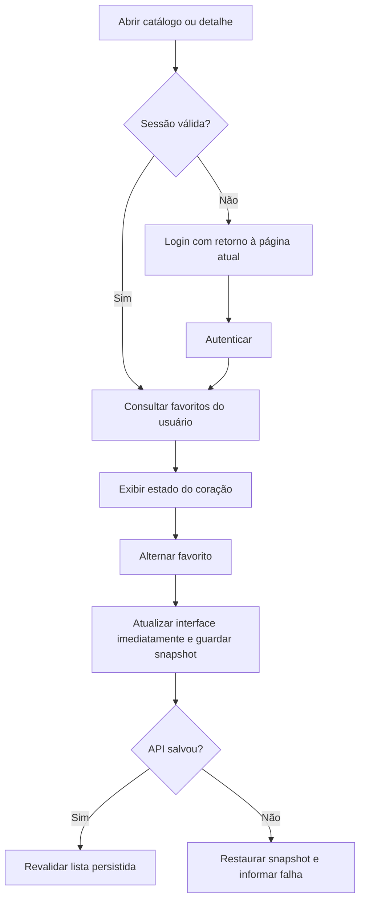
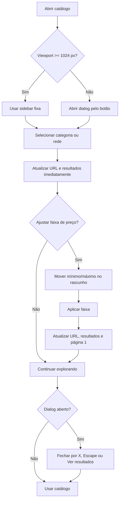

# Fluxos de comportamento

Este documento descreve as ações do usuário, estados, alternativas e resultados esperados. Os IDs `FLOW-*` são estáveis e podem ser referenciados por tarefas, contratos e testes.

Fonte normativa: [desafio](../challenge-description.md) e [REQUIREMENTS](../REQUIREMENTS.md). Detalhes da API: [CONTRACTS](CONTRACTS.md). Decisões técnicas: [ARCHITECTURE](../ARCHITECTURE.md). Implementação simulada: [MOCKS-GUIDE](MOCKS-GUIDE.md). Progresso e evidências: [TASKS](../TASKS.md) e [TEST-MATRIX](TEST-MATRIX.md).

Os fluxos abaixo são a especificação do comportamento esperado. A implementação de cada fluxo está indicada em TASKS e na matriz de evidências.

## Índice e rastreabilidade

| Fluxo | Objetivo | Requisitos | Contratos | Tarefas | Cenários e testes |
| --- | --- | --- | --- | --- | --- |
| FLOW-01 | Revisar a compra e acompanhar confirmação ou recusa, uma rede por pedido | REQ-012, REQ-014, REQ-015, REQ-016, REQ-017, REQ-018, REQ-019, REQ-020 | API-08, API-09, API-12, EVT-01, EVT-02 | TASK-04 (núcleo), TASK-07, TASK-08, TASK-10 | SCN-01, SCN-09, SCN-10, SCN-12, SCN-16, SCN-17; TEST-06, TEST-07, TEST-09, TEST-17 |
| FLOW-02 | Recuperar uma tentativa após timeout, refresh ou reconexão | REQ-016, REQ-017, REQ-019, REQ-022, REQ-023, REQ-036 | API-02, API-09, EVT-02 | TASK-04 (núcleo), TASK-08, TASK-10 | SCN-07, SCN-11, SCN-14, SCN-15; TEST-03, TEST-07, TEST-10 |
| FLOW-03 | Criar conta, autenticar, recuperar sessão e sair | REQ-021, REQ-022, REQ-023, REQ-024, REQ-027 | API-01, API-02 | TASK-06, TASK-11 | SCN-01, SCN-06, SCN-07, SCN-08; TEST-03 |
| FLOW-04 | Consultar e alternar favoritos com autenticação | REQ-008, REQ-021, REQ-023, REQ-027 | API-02, API-04 | TASK-06, TASK-11 | SCN-01, SCN-06, SCN-07, SCN-15; TEST-03, TEST-04 |
| FLOW-05 | Filtrar e explorar o catálogo | REQ-005, REQ-006, REQ-026 | API-03 | TASK-05, TASK-12 | TEST-01, TEST-12, TEST-14 |
| FLOW-06 | Manter, revisar e agrupar o carrinho de visitante ou usuário por rede | REQ-009, REQ-010, REQ-011, REQ-012 | API-05, API-06, API-07, API-08 | TASK-07, TASK-08, TASK-11 | SCN-01, SCN-09; TEST-05, TEST-06, TEST-17 |

## FLOW-01: Compra

**Objetivo:** comprar as quantidades revisadas e mostrar o resultado real da simulação, preservando o carrinho em caso de falha.

**Pré-condições:** usuário autenticado, carrinho com itens, dados do colecionador válidos e carteira cadastrada na rede do grupo selecionado. O carrinho pode conter NFTs de redes diferentes; a pessoa escolhe um grupo no carrinho e cada pedido/cotação inclui somente os NFTs dessa rede (DEC-24). As demais redes permanecem no carrinho para finalizações independentes. A revisão usa uma cotação da API, com preços, disponibilidade, cupom, taxa e total daquele grupo.

No desktop, o formulário do colecionador e o resumo ficam lado a lado. No mobile, a compra avança em três passos — dados, carteira/rede e revisão — e mantém a ação de confirmar acessível na parte inferior. Em ambos os tamanhos, conexão e pagamento são simulações locais; não há chamada a uma carteira real. A cotação exibida expira após cinco minutos.

**Gatilho:** o usuário confirma a compra após revisar os dados e os valores.

### Caminho principal

1. No carrinho, o usuário escolhe “Finalizar [rede]” em um grupo. O checkout mostra somente os NFTs daquele grupo; a rede fica determinada pelos próprios NFTs e a carteira compatível é selecionada automaticamente.
2. O usuário preenche/revisa os dados e aciona **“Revisar compra”**. A interface simula a conexão da carteira e busca uma cotação atualizada para aquele grupo.
3. A interface mostra os itens, valores, taxa e total cotados; o usuário confere a revisão e aciona **“Confirmar compra”** para enviar o pedido. A interface impede cliques concorrentes enquanto resolve essa tentativa.
4. A API revalida a tentativa: sessão, cotação, estoque, cupom, taxas, carteira e conexão.
5. Se estiver tudo válido, cria um pedido **pendente** e reserva as quantidades compradas. A resposta do POST já contém esse pedido; o cliente usa-a para mostrar o estado pendente imediatamente e depois consulta o pedido para acompanhar a confirmação. Os itens do grupo continuam no carrinho enquanto o resultado é aguardado.
6. O pagamento simulado termina em confirmação ou recusa.
7. Se confirmado, o pedido passa a **confirmado**, o estoque reservado é consumido e somente as quantidades capturadas desse grupo são removidas do carrinho. Outros grupos de rede permanecem intactos. A interface mostra o recibo com os dados registrados na compra.

O pedido fica pendente **depois de ser criado pela API e antes de haver resultado do pagamento**. Estar na revisão, clicar no botão ou aguardar a resposta de uma chamada não comprova, por si só, que o pedido existe. Quando o resultado do envio é desconhecido, seguir FLOW-02.

### Estados e efeitos

| Momento | Pedido | Estoque | Carrinho |
| --- | --- | --- | --- |
| Revisão, antes da criação | Ainda não existe | Sem reserva dessa tentativa | Itens preservados |
| Criado, aguardando resultado | Pending | Quantidades da compra reservadas | Itens continuam presentes |
| Pagamento confirmado | Confirmed, terminal | Quantidades reservadas consumidas | Remove somente as quantidades capturadas da compra |
| Pagamento recusado | Declined, terminal | Reserva liberada | Itens preservados |

### Alternativas e falhas

- **Preço, cupom ou taxa alterados:** mostrar a diferença e exigir revisão e nova confirmação; não criar pedido com a cotação antiga.
- **Disponibilidade insuficiente:** informar os itens afetados e permitir corrigir o carrinho antes de uma nova cotação.
- **Campos inválidos ou carteira desconectada:** indicar o problema e permitir correção/reconexão antes de enviar novamente.
- **Sessão expirada:** pedir autenticação e preservar o contexto para retomada pelo mesmo usuário. Revalidar a cotação ao retomar.
- **Pagamento recusado:** mostrar a recusa, liberar a reserva e preservar o carrinho; não exibir recibo de sucesso. Outra compra é uma nova tentativa.
- **Clique repetido ou reenvio da mesma tentativa:** recuperar o mesmo resultado. Uma chave reutilizada com conteúdo diferente gera conflito.
- **Timeout, queda de conexão ou refresh:** seguir FLOW-02 para descobrir o resultado da tentativa existente.

### Regras que sempre devem valer

Confirmado e recusado são estados terminais: não voltam para pendente. Repetir uma atualização não pode consumir estoque ou remover itens novamente. O recibo usa o snapshot da compra; mudanças posteriores no catálogo não alteram seus valores. Identificadores de transação e exploração são apresentados como simulados.

Se o usuário adicionar itens enquanto um pedido está pendente, essas novas inclusões devem sobreviver à confirmação. Exemplo: compra de duas unidades, seguida de adição de mais uma; após confirmar, uma permanece no carrinho. Se as inclusões antigas forem removidas e outras forem adicionadas, as novas também devem permanecer. A estratégia técnica de identificar essas quantidades por lotes está no guia de mocks e em DEC-10.

**Resultado:** pedido confirmado com recibo coerente ou pedido recusado com o grupo preservado. Falha anterior à criação não produz pedido. Cada rede exige sua própria confirmação; o projeto não simula atomicidade entre blockchains. Grupos restantes podem ser finalizados depois, com novas cotações e novos pedidos.

## FLOW-02: Recuperação de tentativa

**Objetivo:** descobrir e acompanhar o resultado de uma compra existente sem criar outra compra por causa de uma resposta perdida.

**Pré-condições:** existe uma tentativa identificada por usuário, chave de idempotência e conteúdo original. O cliente deve preservar essa identificação antes do envio para recuperá-la após refresh.

**Gatilhos:** timeout do envio, queda de conexão, refresh/reabertura da página ou reconexão enquanto o resultado é desconhecido ou o pedido está pendente.

### Caminho principal

1. Informar que o resultado está sendo recuperado. Timeout não é prova de recusa e não autoriza mostrar sucesso.
2. Recuperar a sessão e a identificação da tentativa do usuário autenticado.
3. Consultar a tentativa existente pela chave de idempotência.
4. Se encontrar um pedido pendente, continuar acompanhando esse pedido, com reconciliação pela API REST após reconexão.
5. Se encontrar um pedido confirmado, mostrar seu recibo e reconsultar o carrinho. Se encontrar um pedido recusado, mostrar a recusa e preservar os itens.

### Alternativas e falhas

- **Tentativa não encontrada (404):** o envio original ainda pode estar em andamento. O usuário pode tentar recuperar reenviando o mesmo conteúdo com a mesma chave; não gerar outra chave automaticamente.
- **Conflito já registrado sem pedido:** mostrar o resultado anterior. Uma nova confirmação após corrigir/revisar os dados usa uma nova tentativa, depois de resolver a anterior.
- **Sessão expirada:** autenticar novamente e retomar somente com o mesmo usuário. Outro usuário não acessa o pedido, a tentativa ou os dados privados do anterior.
- **Falha durante a consulta:** manter o resultado como desconhecido, preservar o contexto e permitir repetir a recuperação. Não converter uma falha de rede em pagamento recusado.
- **Evento duplicado ou antigo:** não regredir o estado nem reaplicar efeitos. A API é usada para reconciliar os recursos ativos após reconexão.

**Resultado:** a tentativa original é recuperada ou continua em recuperação explícita. A perda de uma resposta não cria uma nova compra nem limpa o carrinho.

## FLOW-03: Cadastro, login, sessão e logout

**Objetivo:** permitir que uma pessoa crie uma conta ou entre em uma existente para acessar seus recursos privados, retomando a navegação depois da autenticação.

**Pré-condições:** mocks de rede ativos. Para login, a conta existe e a senha corresponde; para cadastro, os campos são válidos e e-mail/nome de usuário ainda não estão em uso.

**Gatilhos:** enviar o formulário de cadastro ou login; abrir uma rota protegida sem sessão; recarregar a aplicação com uma sessão ativa; ou solicitar logout. No desktop, Entrar no header e Favoritar abrem o login em dialog sobre a tela atual, sem alterar a URL. No mobile, esses mesmos acionadores levam à rota `/login`. As rotas `/login` e `/register` seguem acessíveis diretamente em qualquer viewport.

### Caminho principal — login

No desktop, o dialog mantém a página de origem montada e registra o acionador para devolver o foco ao fechar. A pessoa pode alternar entre login e cadastro no próprio dialog; fechar por Escape, clique no backdrop ou botão X descarta a janela. No mobile e no acesso direto, o mesmo formulário aparece na rota dedicada.

1. A pessoa abre Entrar ou tenta acessar uma rota protegida.
2. Se veio de uma rota protegida, o sistema guarda o caminho interno solicitado. Endereços externos não são aceitos como retorno.
3. A pessoa informa e-mail e senha e envia o formulário.
4. A API valida as credenciais e retorna o perfil e um token opaco de sessão. O cliente guarda o token para a sessão atual do navegador e limpa os dados em cache associados à identidade anterior.
5. O sistema retorna ao caminho interno guardado; sem destino anterior, volta à home.
6. Em rotas protegidas, a aplicação consulta a sessão pela API antes de mostrar o conteúdo. Após refresh, recupera o perfil usando o token guardado.

### Caminho principal — cadastro

1. A pessoa informa nome de exibição, nome de usuário, e-mail e senha.
2. O sistema valida os campos localmente e a API valida novamente unicidade e regras do contrato.
3. A API cria a conta, guarda um verificador de senha com salt e inicia a sessão.
4. O cliente guarda o token e segue para o destino interno solicitado ou para a home.

### Logout

1. A pessoa aciona Sair.
2. A aplicação cancela consultas em andamento e pede à API para invalidar a sessão.
3. O token local e o cache em memória são removidos.
4. A pessoa retorna à home como visitante. Ações privadas voltam a pedir login.

### Alternativas e falhas

- **Credenciais incorretas:** mostrar erro sem revelar se o e-mail ou a senha foi o campo inválido; permanecer no login.
- **Cadastro inválido:** indicar que os dados precisam de correção. E-mail ou nome de usuário já usado não cria outra conta nem uma sessão.
- **Sessão ausente ou expirada:** não abrir a rota privada; encaminhar ao login mantendo somente um retorno interno validado. Após autenticar, buscar os dados privados novamente.
- **Falha de rede no login/cadastro:** manter os valores do formulário e oferecer nova tentativa; não indicar autenticação concluída.
- **Troca de identidade:** cancelar consultas e limpar cache antes de mostrar recursos do novo usuário. Uma resposta privada de sessão anterior não pode preencher a interface atual.
- **Falha de rede ao sair:** remover a sessão local e o cache privado mesmo sem confirmação do servidor, e não mostrar a conta anterior como autenticada neste navegador.

**Resultado:** pessoa autenticada com sessão recuperável na aba atual ou visitante sem dados privados expostos. Senhas não são persistidas em claro; a autenticação é simulada pelos handlers MSW e não representa um serviço de produção.

## FLOW-04: Consultar e alternar favoritos

**Objetivo:** deixar uma pessoa autenticada favoritar ou desfavoritar NFTs sem misturar sua lista com a de outra conta e sem apresentar erro como sucesso.

**Pré-condições:** catálogo ou detalhe do NFT carregado. O NFT existe. Favoritos pertencem ao usuário autenticado.

**Gatilho:** abrir o catálogo/detalhe ou acionar o controle de coração.

### Caminho principal

1. Sem sessão, o controle encaminha ao login e guarda o caminho atual para retorno. Não altera favoritos.
2. Com sessão, a aplicação consulta a lista de favoritos da identidade atual.
3. O botão informa visual e semanticamente se o NFT está favoritado (`aria-pressed`).
4. Ao alternar, a interface atualiza o estado imediatamente e guarda uma cópia da lista anterior.
5. Axios envia a escolha explícita à API. O handler identifica o usuário pela sessão, valida que o NFT existe e persiste a alteração.
6. Em sucesso, a consulta de favoritos é revalidada; o mesmo estado aparece ao reabrir o detalhe ou atualizar a página.

### Alternativas e regras de privacidade

- **API rejeita a alteração ou falha:** restaurar o snapshot anterior, informar que não foi possível salvar e permitir nova tentativa.
- **A pessoa troca de conta ou encerra sessão:** cancelar consultas privadas e limpar o cache antes de carregar favoritos de outra identidade.
- **Sessão expira entre a leitura e a alteração:** a API responde 401; limpar a sessão local e encaminhar para autenticação, sem manter o estado otimista como persistido.
- **NFT inexistente:** a API responde 404 e a interface reverte a alteração.
- **Dois usuários:** consultas usam identidade própria e handlers derivam autorização da sessão. Nunca aceitar `userId` do corpo para selecionar a lista.
- **Alterações repetidas:** definir explicitamente `favorite: true` ou `false` torna a operação idempotente; não alternar no servidor por simples inversão de estado.

**Resultado:** favorito confirmado e persistido para o usuário atual ou restauração do estado anterior com erro compreensível. Não há confirmação visual permanente quando a API falha.

## FLOW-05: Filtrar e explorar o catálogo

**Objetivo:** combinar filtros e ordenar os NFTs sem perder a seleção ao atualizar ou navegar no histórico do browser.

**Pré-condições:** catálogo aberto em `/`; a API disponibiliza facetas, contagens e a lista correspondente aos parâmetros da URL.

**Gatilho:** abrir o catálogo e selecionar categorias/redes, ajustar preços, buscar ou mudar a aba/ordenação.

### Apresentação dos filtros por viewport

- Em telas a partir de 1024 px, os filtros ficam permanentemente visíveis na sidebar à esquerda.
- Abaixo de 1024 px, incluindo tablet (768–1023 px) e mobile, o botão “Abrir filtros do catálogo” abre um dialog lateral.
- O dialog fecha por X, Escape ou “Ver resultados”. Fechar não desfaz seleções já aplicadas; após fechar, o foco volta ao botão que abriu o dialog.

### Caminho principal

1. A pessoa escolhe uma ou mais opções em Coleções (categorias de arte) e Rede. Cada clique aplica a seleção imediatamente, atualiza a URL e consulta os resultados; a pessoa pode manter o dialog aberto enquanto seleciona várias opções.
2. Dentro de cada grupo, opções selecionadas combinam por OR; entre grupos, combinam por AND. Assim, duas categorias aceitam NFTs de qualquer uma delas, enquanto uma categoria junto de Ethereum exige que ambas as condições sejam atendidas.
3. Para restringir preços, a pessoa move os controles de mínimo e máximo. O texto do intervalo acompanha o rascunho local, mas resultados e URL só mudam ao acionar “Aplicar”. Mínimo e máximo não se cruzam.
4. Ao aplicar filtros, busca, aba ou ordenação, a página volta para 1. Os demais filtros permanecem ativos.
5. A pessoa pode mudar abas, ordenação e paginação junto dos filtros. A URL representa a combinação aplicada e permite refresh e voltar/avançar no histórico sem perder o estado.
6. “Limpar filtros” restaura todos os parâmetros do catálogo aos padrões, inclusive parâmetros aceitos pela URL que não têm controle visível na sidebar.

As contagens ao lado de Coleções e Rede representam a quantidade de NFTs no catálogo inteiro para cada opção; não diminuem conforme outros filtros ou a página atual. Uma opção selecionada que não exista nas facetas atuais continua visível com contagem zero para que possa ser removida.

### Alternativas e estados

- **Nenhum resultado:** manter os filtros selecionados e oferecer limpeza/ajuste para a pessoa recuperar itens.
- **Erro de facetas ou catálogo:** mostrar erro e opção de tentar novamente; não representar falha como lista vazia.
- **Resposta antiga chega depois de uma consulta mais nova:** ela não substitui os resultados associados à URL atual.
- **Parâmetro inválido em URL:** normalizar para valores permitidos; chamadas diretas inválidas à API retornam 422.
- **Atualizar ou usar histórico:** recarregar os parâmetros da URL; no slider, os valores aplicados são restaurados.

**Resultado:** resultados correspondem aos filtros/ordenação/página na URL, ou o catálogo comunica vazio/erro sem esconder os controles de recuperação.

## Como manter este documento

Ao mudar um comportamento, atualize o fluxo e confira seus vínculos com requisitos, contratos, tarefas e testes. Novos fluxos recebem novos IDs; os existentes não são renumerados. Tempos específicos, bibliotecas, funções e armazenamento pertencem à arquitetura/guia técnico, enquanto este documento descreve o que o usuário deve observar.

## FLOW-06: Carrinho e cupom

**Objetivo:** permitir montar e revisar o carrinho antes de autenticar, sem perder itens ao atualizar a página ou entrar na conta.

**Identidade:** visitante usa um `guestId` estável guardado no navegador e enviado em `X-Guest-Id`; depois do login/cadastro, o bearer token identifica o carrinho da conta. A UI nunca escolhe o `userId` da operação.

### Caminho principal

1. O detalhe envia NFT, edição, quantidade e versão do carrinho à API. A API valida edição, inteiro positivo, versão e estoque.
2. Carrinho e cupom ficam no IndexedDB do mock. A página consulta a API ao abrir/atualizar, e subtotais, descontos, taxa estimada e total são calculados no servidor usando wei inteiro.
3. Alterar/remover quantidade envia a versão lida. Conflito de versão ou estoque mantém o estado do servidor e pede nova consulta; não aplica uma alteração local silenciosa.
4. Aplicar cupom válido atualiza a versão e o resumo. Código inválido/expirado retorna erro sem alterar o carrinho; remover cupom é uma operação explícita.
5. No login/cadastro, o cliente captura a versão do carrinho visitante antes de autenticar e chama o merge privado. Merge repetido para a mesma versão não duplica linhas. Estoque insuficiente e conflito entre cupons aparecem como avisos, sem ocultar itens sem explicação.
6. O carrinho da conta passa a ser a origem após autenticar. Checkout continua uma etapa protegida e separada (FLOW-01/TASK-08).

**Resultado:** carrinho permanece disponível em refresh, visitante pode começar sem conta, e totais exibidos refletem a resposta da API. Preço/estoque podem mudar e serão revalidados na cotação de checkout.
