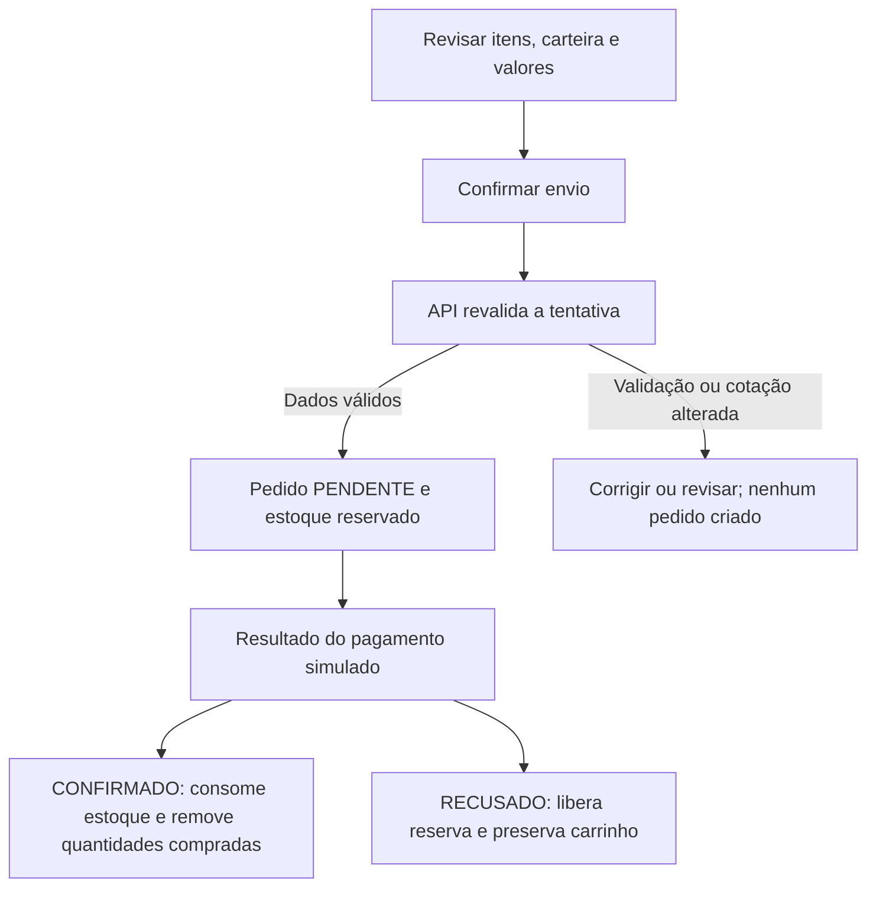
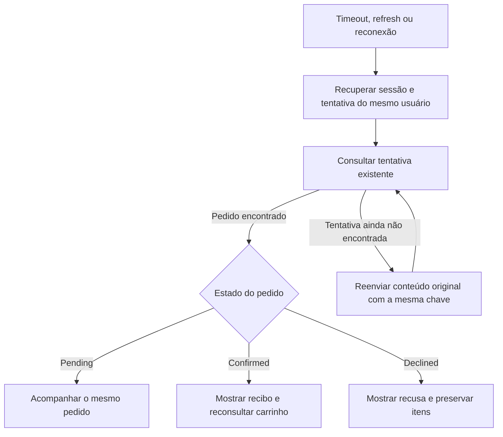

# Fluxos de comportamento

Este documento descreve as ações do usuário, estados, alternativas e resultados esperados. Os IDs `FLOW-*` são estáveis e podem ser referenciados por tarefas, contratos e testes.

Fonte normativa: [desafio](../challenge-description.md) e [REQUIREMENTS](../REQUIREMENTS.md). Detalhes da API: [CONTRACTS](CONTRACTS.md). Decisões técnicas: [ARCHITECTURE](../ARCHITECTURE.md). Implementação simulada: [MOCKS-GUIDE](MOCKS-GUIDE.md). Progresso e evidências: [TASKS](../TASKS.md) e [TEST-MATRIX](TEST-MATRIX.md).

Os fluxos abaixo são a especificação do comportamento esperado. A existência deste documento não significa que as telas e integrações já estão entregues; consulte TASKS para o estado de execução.

## Índice e rastreabilidade

| Fluxo | Objetivo | Requisitos | Contratos | Tarefas | Cenários e testes |
| --- | --- | --- | --- | --- | --- |
| FLOW-01 | Revisar a compra e acompanhar confirmação ou recusa | REQ-012, REQ-014, REQ-015, REQ-016, REQ-017, REQ-018, REQ-019, REQ-020 | API-08, API-09, API-12, EVT-01, EVT-02 | TASK-04 (núcleo), TASK-07, TASK-08, TASK-10 | SCN-01, SCN-09, SCN-10, SCN-12, SCN-16, SCN-17; TEST-06, TEST-07, TEST-09, TEST-17 |
| FLOW-02 | Recuperar uma tentativa após timeout, refresh ou reconexão | REQ-016, REQ-017, REQ-019, REQ-022, REQ-023, REQ-036 | API-02, API-09, EVT-02 | TASK-04 (núcleo), TASK-08, TASK-10 | SCN-07, SCN-11, SCN-14, SCN-15; TEST-03, TEST-07, TEST-10 |

## FLOW-01: Compra

**Objetivo:** comprar as quantidades revisadas e mostrar o resultado real da simulação, preservando o carrinho em caso de falha.

**Pré-condições:** usuário autenticado, carrinho com itens, dados do colecionador válidos e carteira cadastrada conectada à rede selecionada. A revisão usa uma cotação da API, com preços, disponibilidade, cupom, taxas e total.

**Gatilho:** o usuário confirma a compra após revisar os dados e os valores.

### Caminho principal

1. O usuário revisa itens, quantidades, dados, carteira, rede e valores.
2. Confirma o envio. A interface impede cliques concorrentes enquanto resolve essa tentativa.
3. A API revalida a tentativa: sessão, cotação, estoque, cupom, taxas, carteira e conexão.
4. Se estiver tudo válido, cria um pedido **pendente** e reserva as quantidades compradas. Os itens continuam no carrinho enquanto o resultado é aguardado.
5. O pagamento simulado termina em confirmação ou recusa.
6. Se confirmado, o pedido passa a **confirmado**, o estoque reservado é consumido e somente as quantidades compradas são removidas do carrinho. A interface mostra o recibo com os dados registrados na compra.

O pedido fica pendente **depois de ser criado pela API e antes de haver resultado do pagamento**. Estar na revisão, clicar no botão ou aguardar a resposta de uma chamada não comprova, por si só, que o pedido existe. Quando o resultado do envio é desconhecido, seguir FLOW-02.

### Estados e efeitos

| Momento | Pedido | Estoque | Carrinho |
| --- | --- | --- | --- |
| Revisão, antes da criação | Ainda não existe | Sem reserva dessa tentativa | Itens preservados |
| Criado, aguardando resultado | Pending | Quantidades da compra reservadas | Itens continuam presentes |
| Pagamento confirmado | Confirmed, terminal | Quantidades reservadas consumidas | Remove somente as quantidades capturadas da compra |
| Pagamento recusado | Declined, terminal | Reserva liberada | Itens preservados |

### Alternativas e falhas

- **Preço, cupom ou taxa alterados:** mostrar a diferença e exigir revisão e nova confirmação; não criar pedido com a cotação antiga.
- **Disponibilidade insuficiente:** informar os itens afetados e permitir corrigir o carrinho antes de uma nova cotação.
- **Campos inválidos ou carteira desconectada:** indicar o problema e permitir correção/reconexão antes de enviar novamente.
- **Sessão expirada:** pedir autenticação e preservar o contexto para retomada pelo mesmo usuário. Revalidar a cotação ao retomar.
- **Pagamento recusado:** mostrar a recusa, liberar a reserva e preservar o carrinho; não exibir recibo de sucesso. Outra compra é uma nova tentativa.
- **Clique repetido ou reenvio da mesma tentativa:** recuperar o mesmo resultado. Uma chave reutilizada com conteúdo diferente gera conflito.
- **Timeout, queda de conexão ou refresh:** seguir FLOW-02 para descobrir o resultado da tentativa existente.

### Regras que sempre devem valer

Confirmado e recusado são estados terminais: não voltam para pendente. Repetir uma atualização não pode consumir estoque ou remover itens novamente. O recibo usa o snapshot da compra; mudanças posteriores no catálogo não alteram seus valores. Identificadores de transação e exploração são apresentados como simulados.

Se o usuário adicionar itens enquanto um pedido está pendente, essas novas inclusões devem sobreviver à confirmação. Exemplo: compra de duas unidades, seguida de adição de mais uma; após confirmar, uma permanece no carrinho. Se as inclusões antigas forem removidas e outras forem adicionadas, as novas também devem permanecer. A estratégia técnica de identificar essas quantidades por lotes está no guia de mocks e em DEC-10.

**Resultado:** pedido confirmado com recibo coerente ou pedido recusado com carrinho preservado. Falha anterior à criação não produz pedido.

## FLOW-02: Recuperação de tentativa

**Objetivo:** descobrir e acompanhar o resultado de uma compra existente sem criar outra compra por causa de uma resposta perdida.

**Pré-condições:** existe uma tentativa identificada por usuário, chave de idempotência e conteúdo original. O cliente deve preservar essa identificação antes do envio para recuperá-la após refresh.

**Gatilhos:** timeout do envio, queda de conexão, refresh/reabertura da página ou reconexão enquanto o resultado é desconhecido ou o pedido está pendente.

### Caminho principal

1. Informar que o resultado está sendo recuperado. Timeout não é prova de recusa e não autoriza mostrar sucesso.
2. Recuperar a sessão e a identificação da tentativa do usuário autenticado.
3. Consultar a tentativa existente pela chave de idempotência.
4. Se encontrar um pedido pendente, continuar acompanhando esse pedido, com reconciliação pela API REST após reconexão.
5. Se encontrar um pedido confirmado, mostrar seu recibo e reconsultar o carrinho. Se encontrar um pedido recusado, mostrar a recusa e preservar os itens.

### Alternativas e falhas

- **Tentativa não encontrada (404):** o envio original ainda pode estar em andamento. O usuário pode tentar recuperar reenviando o mesmo conteúdo com a mesma chave; não gerar outra chave automaticamente.
- **Conflito já registrado sem pedido:** mostrar o resultado anterior. Uma nova confirmação após corrigir/revisar os dados usa uma nova tentativa, depois de resolver a anterior.
- **Sessão expirada:** autenticar novamente e retomar somente com o mesmo usuário. Outro usuário não acessa o pedido, a tentativa ou os dados privados do anterior.
- **Falha durante a consulta:** manter o resultado como desconhecido, preservar o contexto e permitir repetir a recuperação. Não converter uma falha de rede em pagamento recusado.
- **Evento duplicado ou antigo:** não regredir o estado nem reaplicar efeitos. A API é usada para reconciliar os recursos ativos após reconexão.

**Resultado:** a tentativa original é recuperada ou continua em recuperação explícita. A perda de uma resposta não cria uma nova compra nem limpa o carrinho.

## Como manter este documento

Ao mudar um comportamento, atualize o fluxo e confira seus vínculos com requisitos, contratos, tarefas e testes. Novos fluxos recebem novos IDs; os existentes não são renumerados. Tempos específicos, bibliotecas, funções e armazenamento pertencem à arquitetura/guia técnico, enquanto este documento descreve o que o usuário deve observar.
