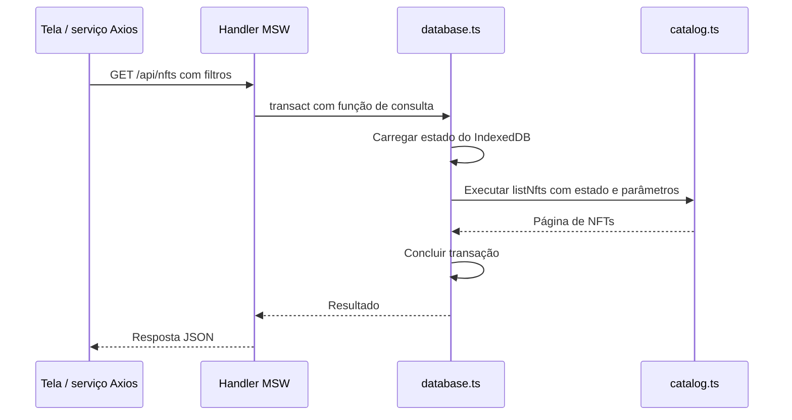

# Como funciona a base simulada

Guia para entender os arquivos da TASK-04 e continuar o desenvolvimento. O progresso é registrado em [TASKS](../TASKS.md) e os resultados em [TEST-MATRIX](TEST-MATRIX.md). Este documento explica a implementação; [FLOWS](FLOWS.md) descreve o comportamento esperado, [CONTRACTS](CONTRACTS.md) define a API e [ARCHITECTURE](../ARCHITECTURE.md) registra as decisões.

## Fixtures, banco e mocks

**Mock data** é um nome genérico para dados fictícios. Chamamos de **fixtures** o conjunto inicial conhecido e repetível: os mesmos NFTs, dois usuários, carteiras, favoritos e carrinhos vazios. Isso permite começar uma demonstração ou teste sabendo o que esperar.

O **banco simulado** começa com essas fixtures e guarda as mudanças feitas durante o uso. Se um usuário adicionar um NFT ao carrinho, o estado inicial muda. IndexedDB salva esse estado no navegador para que ele sobreviva ao refresh. Cada origem tem seu próprio banco: os dados locais e os dados da aplicação publicada são independentes.

Os **mocks do MSW** são os handlers que interceptam chamadas de rede e simulam respostas de uma API. Eles consultam ou alteram o banco usando as regras do domínio. Por isso, os componentes podem usar Axios normalmente, sem importar dados fictícios.

Rastreabilidade: REQ-029, REQ-030; DEC-03, DEC-05; API-03, API-13.

## Mapa dos arquivos

| Arquivo | Responsabilidade | Relações principais |
| --- | --- | --- |
| [contracts/marketplace.ts](../src/contracts/marketplace.ts) | Define os formatos públicos: NFT, perfil, carteira, carrinho, cotação, pedido e eventos | Tipos compartilhados por mocks e futuros serviços/telas; REQ-025, DEC-19 |
| [mocks/state.ts](../src/mocks/state.ts) | Define a organização interna do banco, sua versão, relógio, reservas, tentativas, carrinhos de visitante e lotes de quantidade | Usado por fixtures, database, catálogo e comércio; DEC-05, DEC-10 |
| [mocks/fixtures.ts](../src/mocks/fixtures.ts) | Cria os dados iniciais e verificadores das senhas fictícias | Usa contratos/state; database usa as fixtures na inicialização e no reset; REQ-030, DEC-17 |
| [mocks/database.ts](../src/mocks/database.ts) | Abre IndexedDB, carrega/salva o estado e executa operações em uma transação | Recebe uma função que consulta/altera o estado; usa fixtures e a versão de state; DEC-05 |
| [lib/money.ts](../src/lib/money.ts) | Converte ETH para wei e calcula subtotal, desconto, taxa e total com precisão | Usado pelo catálogo para comparar preços e por commerce para calcular totais; REQ-012, DEC-06 |
| [mocks/catalog.ts](../src/mocks/catalog.ts) | Valida parâmetros, consulta NFTs e aplica filtros, ordenação e paginação | Recebe o estado do banco; considera reservas para mostrar disponibilidade; REQ-006, API-03 |
| [mocks/commerce.ts](../src/mocks/commerce.ts) | Aplica regras de carrinho, merge de visitante, cupom, cotação, reserva, idempotência e resolução de pedidos | Recebe o estado; usa catálogo, dinheiro e erros; REQ-009 a REQ-012, REQ-016, DEC-08 a DEC-10 |
| [mocks/errors.ts](../src/mocks/errors.ts) | Representa erros com status HTTP, código e mensagem | Regras lançam MockError; handlers transformam o erro em resposta; API-03, API-08, API-09 |
| [mocks/handlers.ts](../src/mocks/handlers.ts) | Liga endereços HTTP e conexões Socket.IO ao comportamento simulado | Aciona database e regras; devolve JSON ou erro; REQ-029 |
| [mocks/browser.ts](../src/mocks/browser.ts) | Inicializa o banco e inicia o worker MSW | Configura os handlers e verifica o cenário disponível; DEC-04 |
| [app/providers.tsx](../src/app/providers.tsx) | Aguarda a inicialização dos mocks antes de montar as rotas | Chama initializeMocks de browser.ts quando mocks estão habilitados |

`marketplace.ts` descreve o que pode trafegar pela API. `state.ts` inclui detalhes internos que não precisam chegar à tela: verificadores de senha, reservas, fingerprint de tentativas e lotes do carrinho. Essa separação evita devolver o banco inteiro em uma resposta.

## Carrinho visitante e merge após autenticação

O fluxo funcional está em [FLOW-06](FLOWS.md#flow-06-carrinho-e-cupom). `lib/guest-id.ts` cria e persiste um identificador anônimo no `localStorage`; o interceptor Axios envia `X-Guest-Id`. Sem bearer token, os handlers gravam em `guest:<id>`; com token, usam `user:<id>`. O identificador de visitante nunca concede acesso ao carrinho de uma conta.

Ao entrar/criar conta, o formulário lê a versão do carrinho visitante antes de gravar a sessão e chama `POST /api/cart/merge`. O reducer move as quantidades para o carrinho autenticado, respeita estoque, comunica conflitos como avisos e marca a versão de origem consumida. Repetir a mesma versão retorna o resultado sem duplicar itens. A versão do schema do IndexedDB mudou para 2; o banco antigo é semeado novamente para manter o estado compatível.

## Exemplo: consultar o catálogo

A API de catálogo já está implementada; a tela irá consumi-la na TASK-05.

O handler usa `transact(state => listNfts(state, params))`. O banco executa essa função sobre o estado carregado; `catalog.ts` não abre IndexedDB por conta própria. A versão atual usa transações readwrite também para consultas, pois elas podem precisar inicializar ou restaurar o banco.

Uma busca sem correspondência devolve uma página vazia. Parâmetros inválidos geram 422; um detalhe inexistente gera 404. Tratar cancelamento/respostas antigas na interface pertence à TASK-05 (REQ-006, REQ-027).

## Implementação dos fluxos de compra

O comportamento da compra e de sua recuperação está em [FLOW-01](FLOWS.md#flow-01-compra) e [FLOW-02](FLOWS.md#flow-02-recuperação-de-tentativa). O núcleo dessas regras existe em `commerce.ts`. Os endpoints privados e a interface serão conectados nas tarefas de sessão, carrinho e checkout.

1. O carrinho guarda NFT, edição e quantidades. `readCart` consulta preços e disponibilidade atuais e calcula o resumo.
2. `createQuote` valida carrinho, cupom, estoque e rede. Guarda uma cópia dos itens/totais para revisão, com validade de cinco minutos do relógio simulado.
3. `submitOrder` verifica se a chave de tentativa já existe para aquele usuário. Mesmo conteúdo recupera o resultado; conteúdo diferente gera conflito. Só uma tentativa nova revalida a cotação e a conexão da carteira.
4. Uma cotação alterada exige nova revisão. Uma cotação válida cria o pedido pendente e reserva estoque. Pedido, reserva e registro da tentativa devem ser salvos na mesma transação.
5. `advanceClock` resolve pedidos vencidos. Na confirmação, baixa estoque e remove do carrinho as quantidades capturadas. Na recusa, libera a reserva e preserva o carrinho.

O recibo usa o **snapshot**, uma cópia dos dados da compra. Se o preço do NFT mudar depois, o total do pedido confirmado continua igual. Resolver um pedido terminal novamente não reaplica seus efeitos.

### Como os lotes identificam as quantidades compradas

O comportamento esperado para adições ao carrinho durante uma compra está em [FLOW-01](FLOWS.md#flow-01-compra). A implementação usa IDs de lote para distinguir as inclusões.

`addCartItem` cria um novo lote a cada adição. `createQuote` captura os lotes por ID de linha em `StoredQuote.lots`; `submitOrder` copia essa informação para `StoredOrder.lots`. Na confirmação, `settleOrder` desconta apenas quantidades de lotes com os mesmos IDs ainda presentes no carrinho. Inclusões posteriores têm outros IDs e são preservadas. DEC-10; REQ-019.

## Por que o banco tem uma versão?

A versão identifica o **formato dos dados salvos**, por exemplo, `schemaVersion: 1`. Ela é uma escolha de implementação (DEC-05); o desafio exige os comportamentos de consistência/refresh/reset, mas não determina esse formato.

Se uma mudança tornar os dados antigos incompatíveis, aumentamos SCHEMA_VERSION. Na próxima operação, database.ts percebe que o formato salvo é diferente e restaura as fixtures. As alterações anteriores da demonstração, como carrinho e pedidos, são descartadas. Não implementamos migrações nesta etapa.

Essa versão é diferente de `nft.version` ou `order.version`: a versão do recurso identifica atualizações daquele NFT/pedido e será usada para tratar respostas/eventos antigos (DEC-12).

## O que é uma transação?

Uma transação permite salvar mudanças relacionadas juntas. Em uma compra, precisamos registrar pedido, reserva de estoque e tentativa de idempotência. Se uma etapa falhar, a transação pode abortar sem salvar uma parte isolada.

Em database.ts, a função recebida por `transact` deve ser síncrona: não coloque `await`, chamadas HTTP ou temporizadores dentro dela. Prepare o necessário antes e execute as regras com o estado recebido. O resultado só é devolvido depois de o IndexedDB concluir o commit. Essa é uma gravação do banco; não é um commit Git.

## Dinheiro e tempo

ETH trafega como texto, por exemplo, `"0.1"`. Para calcular, money.ts converte para wei usando BigInt: um ETH corresponde a 10¹⁸ wei. Depois, converte o resultado novamente para texto. Isso evita imprecisões de ponto flutuante. Desconto usa basis points: 1.000 representa 10%; frações menores que um wei são arredondadas para baixo. REQ-012; DEC-06.

O relógio da simulação começa em `2026-01-15T12:00:00Z` e avança por comando. Nesta etapa, esperar dois segundos reais não resolve um pedido: é necessário avançar o relógio do domínio. Scheduler e eventos de domínio entram nas TASK-10/TASK-11.

Controles disponíveis quando os mocks estão habilitados:

| Chamada | Efeito |
| --- | --- |
| GET `/api/__mock/status` | Consulta schema, cenário, relógio e contagens de NFTs/usuários |
| POST `/api/__mock/reset` com `{"scenarioId":"SCN-01"}` | Restaura todo o banco e fecha os sockets desta aba |
| POST `/api/__mock/clock` com `{"advanceMs":2000}` | Avança o relógio e resolve pedidos vencidos no núcleo |

Reset não limpa automaticamente o estado de formulário/cache da interface; o painel da TASK-11 deverá cuidar desse ciclo. Outros cenários, controle de falhas e emissão de eventos continuam planejados em [SCENARIOS](SCENARIOS.md).

## Como testar e continuar o desenvolvimento

| Arquivo / comando | O que verifica |
| --- | --- |
| [tests/unit/marketplace.spec.ts](../tests/unit/marketplace.spec.ts) · `npm run test:unit` | Regras diretamente, sem browser: precisão, filtros, fixtures, idempotência, cotação, reserva e efeitos de confirmação/recusa |
| [playwright.unit.config.ts](../playwright.unit.config.ts) | Configura o runner unitário sem navegador ou servidor HTTP |
| [tests/e2e/mock-foundation.spec.ts](../tests/e2e/mock-foundation.spec.ts) · `npm run test:e2e` | Handlers MSW, catálogo e persistência/reset no navegador, em desktop/mobile |

Os testes da fundação não substituem os E2E dos fluxos de negócio exigidos pelo desafio. Resultados e pendências ficam na [TEST-MATRIX](TEST-MATRIX.md).

Ao implementar uma funcionalidade, siga esta ordem: definir entrada/saída no contrato, implementar a regra no domínio, conectá-la ao handler usando a transação e então criar o serviço Axios/hook Query que a tela consumirá. Componentes e hooks não importam fixtures nem alteram o banco diretamente (DEC-03; REQ-029).

Quando mudar o código, atualize este guia se o fluxo entre arquivos mudar; atualize FLOWS se o comportamento esperado mudar, CONTRACTS se o formato da API mudar e ARCHITECTURE se uma decisão mudar. Registre progresso em TASKS e resultados em TEST-MATRIX.
