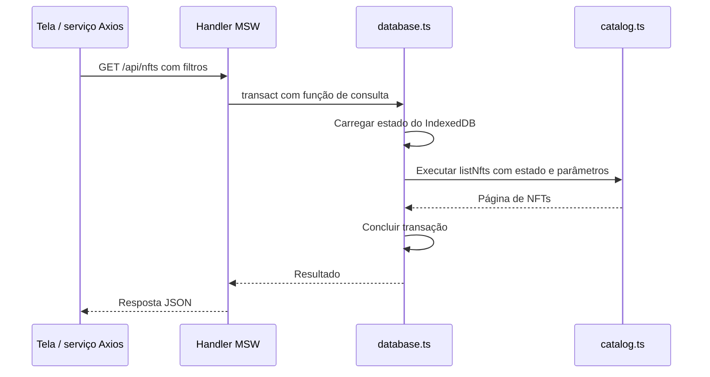

# Como funciona a base simulada

Guia da implementação para quem avalia o projeto ou precisa continuar seu desenvolvimento. A simulação permite demonstrar persistência, autenticação, compra e atualização por eventos usando chamadas de rede da aplicação, sem um servidor externo de negócio.

Para uma demonstração prática, use [SCENARIOS](SCENARIOS.md). Para conferir formatos e endpoints, use [CONTRACTS](CONTRACTS.md). Este guia explica como os arquivos colaboram; [FLOWS](FLOWS.md) descreve o comportamento esperado e [ARCHITECTURE](../ARCHITECTURE.md) registra as decisões. Progresso e evidências ficam em [TASKS](../TASKS.md) e [TEST-MATRIX](TEST-MATRIX.md).

## Fixtures, banco e mocks

**Mock data** é um nome genérico para dados fictícios. Chamamos de **fixtures** o conjunto inicial conhecido e repetível: os mesmos NFTs, dois usuários, carteiras, favoritos e carrinhos vazios. Isso permite começar uma demonstração ou teste sabendo o que esperar.

O **banco simulado** começa com essas fixtures e guarda as mudanças feitas durante o uso. Se um usuário adicionar um NFT ao carrinho, o estado inicial muda. IndexedDB salva esse estado no navegador para que ele sobreviva ao refresh. Cada origem tem seu próprio banco: os dados locais e os dados da aplicação publicada são independentes.

Os **mocks do MSW** são os handlers que interceptam chamadas de rede e simulam respostas de uma API. Eles consultam ou alteram o banco usando as regras do domínio. Por isso, os componentes podem usar Axios normalmente, sem importar dados fictícios.

O caminho principal é **tela → serviço Axios → handler MSW → regra de domínio → transação IndexedDB → resposta**. Nas operações de pedido, os handlers também publicam eventos Socket.IO depois da gravação; o consumidor atualiza ou invalida o cache do TanStack Query.

As regras de posse e sessão são exercitadas pelos handlers locais. Carteiras, pagamentos e transações continuam fictícios; essa implementação demonstra o contrato e a consistência do fluxo, sem autenticação de servidor ou conexão com blockchain.

Rastreabilidade: REQ-029, REQ-030; DEC-03, DEC-05; API-03, API-13.

## Mapa dos arquivos

| Arquivo | Responsabilidade | Relações principais |
| --- | --- | --- |
| [contracts/marketplace.ts](../src/contracts/marketplace.ts) | Define os formatos públicos: NFT, perfil, carteira, carrinho, cotação, pedido e eventos | Tipos compartilhados por mocks e serviços/telas; REQ-025, DEC-19 |
| [mocks/state.ts](../src/mocks/state.ts) | Define a organização interna do banco, sua versão, relógio, reservas, tentativas, carrinhos de visitante e lotes de quantidade | Usado por fixtures, database, catálogo e comércio; DEC-05, DEC-10 |
| [mocks/fixtures.ts](../src/mocks/fixtures.ts) | Cria os dados iniciais e verificadores das senhas fictícias | Usa contratos/state; database usa as fixtures na inicialização e no reset; REQ-030, DEC-17 |
| [mocks/database.ts](../src/mocks/database.ts) | Abre IndexedDB, carrega/salva o estado e executa operações em uma transação | Recebe uma função que consulta/altera o estado; usa fixtures e a versão de state; DEC-05 |
| [lib/money.ts](../src/lib/money.ts) | Converte ETH para wei e calcula subtotal, desconto, taxa e total com precisão | Usado pelo catálogo para comparar preços e por commerce para calcular totais; REQ-012, DEC-06 |
| [mocks/catalog.ts](../src/mocks/catalog.ts) | Valida parâmetros, consulta NFTs e aplica filtros, ordenação e paginação | Recebe o estado do banco; considera reservas para mostrar disponibilidade; REQ-006, API-03 |
| [mocks/commerce.ts](../src/mocks/commerce.ts) | Aplica regras de carrinho, merge de visitante, cupom, cotação, reserva, idempotência e resolução de pedidos | Recebe o estado; usa catálogo, dinheiro e erros; REQ-009 a REQ-012, REQ-016, DEC-08 a DEC-10 |
| [mocks/auth.ts](../src/mocks/auth.ts) e [mocks/wallets.ts](../src/mocks/wallets.ts) | Validam sessão, conta, favoritos, perfil, senha e cadastro/edição de carteiras | Recursos privados são associados à conta obtida da sessão; API-01/API-02/API-04/API-10/API-11 |
| [features/checkout/api.ts](../src/features/checkout/api.ts) | Serviços Axios e queries para carteira, conexão, cotação, pedido e recuperação | Checkout fala com a API e não acessa fixtures/banco diretamente; API-08/API-09/API-11/API-12 |
| [routes/checkout-page.tsx](../src/routes/checkout-page.tsx) e [routes/order-page.tsx](../src/routes/order-page.tsx) | Formulário/resumo responsivo, passos mobile, revisão, recuperação e estados do pedido/recibo | Consomem os serviços do checkout; só mostram recibo no estado confirmado; FLOW-01/FLOW-02 |
| [mocks/errors.ts](../src/mocks/errors.ts) | Representa erros com status HTTP, código e mensagem | Regras lançam MockError; handlers transformam o erro em resposta; API-03, API-08, API-09 |
| [mocks/handlers.ts](../src/mocks/handlers.ts) | Liga endereços HTTP e conexões Socket.IO ao comportamento simulado | Aciona database e regras; devolve JSON ou erro; REQ-029 |
| [mocks/domain-events.ts](../src/mocks/domain-events.ts) | Cria envelopes com snapshot, versão e ID determinístico por recurso | Handlers publicam depois da transação; EVT-01/EVT-02 |
| [features/realtime/domain-event-consumer.ts](../src/features/realtime/domain-event-consumer.ts) e [reconciliation.ts](../src/features/realtime/reconciliation.ts) | Validam eventos e apoiam a comparação dos termos da cotação após reconexão | Consumidos pelos providers e checkout; DEC-12, REQ-034/REQ-035 |
| [mocks/browser.ts](../src/mocks/browser.ts) | Inicializa o banco e inicia o worker MSW | Configura os handlers e verifica o cenário disponível; DEC-04 |
| [app/providers.tsx](../src/app/providers.tsx) | Aguarda o worker, conecta o socket e aplica eventos/reconciliação no cache | Chama initializeMocks; autentica socket para pedidos privados e libera listeners/cache na troca de conta |

`marketplace.ts` descreve o que pode trafegar pela API. `state.ts` inclui detalhes internos que não precisam chegar à tela: verificadores de senha, reservas, fingerprint de tentativas e lotes do carrinho. Essa separação evita devolver o banco inteiro em uma resposta.

## Carrinho visitante e merge após autenticação

O fluxo funcional está em [FLOW-06](FLOWS.md#flow-06-carrinho-e-cupom). `lib/guest-id.ts` cria e persiste um identificador anônimo no `localStorage`; o interceptor Axios envia `X-Guest-Id`. Sem bearer token, os handlers gravam em `guest:<id>`; com token, usam `user:<id>`. O identificador de visitante nunca concede acesso ao carrinho de uma conta.

Ao entrar/criar conta, o formulário lê a versão do carrinho visitante antes de gravar a sessão e chama `POST /api/cart/merge`. O reducer move as quantidades para o carrinho autenticado, respeita estoque, comunica conflitos como avisos e marca a versão de origem consumida. Repetir a mesma versão não duplica itens. O identificador de visitante permanece no navegador após logout; ele não passa a identificar a conta autenticada.

### Onde cada estado é guardado

| Local | Conteúdo | Comportamento no refresh |
| --- | --- | --- |
| IndexedDB `kurio-demo`, store `state`, registro `database` | Usuários, verificadores de senha, NFTs, carteiras, carrinhos, sessões, cotações, pedidos, reservas e tentativas | Preservado quando o schema é compatível |
| `sessionStorage` | Token fictício da sessão | Mantido no refresh da aba; a API valida a sessão no banco |
| `localStorage` | ID de visitante e tentativa de compra por usuário (`kurio-order-attempt:<userId>`) | Preservado; tentativa inclui chave e `OrderInput`, com dados do colecionador, sem senha |
| Memória da aplicação | Cache Query, formulários, socket, timers e controles transitórios de catálogo/favoritos | Recriado; pedidos pendentes podem voltar a ser acompanhados por REST |

O avatar fica como data URL dentro do perfil no IndexedDB. Perfil e senha têm operações independentes, conforme DEC-30. As versões dos recursos impedem gravações concorrentes obsoletas; o reset não limpa automaticamente storage/cache/formulários do cliente. O procedimento de reinício em [SCENARIOS](SCENARIOS.md) cobre essa preparação.

## Exemplo: consultar o catálogo

A tela de catálogo usa serviços Axios e queries com os filtros representados na URL. A simulação devolve dados filtrados, ordenados e paginados.

O handler usa `transact(state => listNfts(state, params))`. O banco executa essa função sobre o estado carregado; `catalog.ts` não abre IndexedDB por conta própria. A versão atual usa transações readwrite também para consultas, pois elas podem precisar inicializar ou restaurar o banco.

Uma busca sem correspondência devolve uma página vazia. Parâmetros inválidos enviados diretamente à API geram 422; um detalhe inexistente gera 404. Queries passam o sinal de cancelamento ao Axios e usam chaves por parâmetros, mantendo buscas distintas separadas no cache. Isso não comprova uma garantia geral contra toda resposta REST antiga concorrente com eventos.

## Implementação dos fluxos de compra

O comportamento da compra e de sua recuperação está em [FLOW-01](FLOWS.md#flow-01-compra) e [FLOW-02](FLOWS.md#flow-02-recuperação-de-tentativa). O domínio em `commerce.ts`, handlers privados e telas foram conectados na TASK-08; os eventos e a reconciliação foram implementados nas TASK-10A a TASK-10D; a recuperação idempotente de resposta ambígua foi concluída na TASK-10E. Os controles de rede de catálogo, detalhe, carrinho e favoritos, relógio e pagamento estão disponíveis, mas não cobrem todas as variantes de falha dos 18 cenários; veja [SCENARIOS.md](SCENARIOS.md).

1. O carrinho guarda NFT, edição e quantidades. `readCart` consulta preços e disponibilidade atuais e calcula o resumo.
2. `readCart` inclui a rede em cada linha e calcula `networkTotals` para cada rede presente. `createQuote` recebe a rede do grupo escolhido, valida a versão global do carrinho e guarda apenas os itens/totais dessa rede para revisão, com validade de cinco minutos do relógio simulado.
3. `submitOrder` verifica se a chave de tentativa já existe para aquele usuário. Mesmo conteúdo recupera o resultado; conteúdo diferente gera conflito. Só uma tentativa nova revalida a cotação e a conexão da carteira.
4. Uma cotação alterada exige nova revisão. Uma cotação válida cria o pedido pendente e reserva estoque. Pedido, reserva e registro da tentativa são salvos na mesma transação; os eventos correspondentes são publicados depois.
5. `advanceClock` resolve pedidos vencidos. Na confirmação, baixa estoque e remove do carrinho somente as quantidades capturadas daquele grupo de rede. Na recusa, libera a reserva e preserva o grupo. Outros grupos permanecem no carrinho e exigem suas próprias cotações e pedidos; não há atomicidade multichain (DEC-24).

O recibo usa o **snapshot**, uma cópia dos dados da compra. Se o preço do NFT mudar depois, o total do pedido confirmado continua igual. Resolver um pedido terminal novamente não reaplica seus efeitos.

A tela salva a chave de idempotência e o payload antes de enviar o pedido. Na recuperação, consulta a tentativa existente; se ela não for encontrada, pode reenviar o mesmo conteúdo com a mesma chave. `loseResponseOnce` retorna 504 depois de persistir o pedido para exercitar esse resultado ambíguo. O E2E desktop/mobile desse fluxo foi confirmado na TASK-10E. Isso não simula um timeout HTTP real causado por resposta atrasada; consulte SCN-11 para esse limite.

## Eventos e reconexão

`nft.updated` é público e informa um snapshot do NFT. `order.updated` é privado e inclui usuário e sessão. No socket, o cliente envia `session.authenticate` com o token; o mock responde com `session.authenticated` e o ID da sessão. Um pedido só é publicado para conexões com a identidade correspondente e sessão ainda ativa.

O consumidor valida o envelope, deduplica IDs e compara versões. Atualiza detalhe/pedido e invalida listas, facetas e carrinhos afetados; a confirmação não executa baixa financeira no cliente. Ao sair ou trocar de conta, libera socket/listeners e limpa o cache privado da identidade anterior.

Após reconexão, consultas REST reconciliam o estado que pode ter mudado sem evento. O evento `online` do navegador também inicia esse processo. O checkout recria a cotação e compara seus termos para encaminhar alterações à revisão. Pedidos pendentes também têm consulta periódica de 750 ms, encerrada no estado terminal.

Transações IndexedDB serializam alterações no store, inclusive entre abas da mesma origem. A publicação Socket.IO pertence à aba que executa o handler; não há broadcast geral entre abas. O transporte cobre WebSocket, mensagens textuais e namespace padrão, conforme os limites em [CONTRACTS](CONTRACTS.md).

### Como os lotes identificam as quantidades compradas

O comportamento esperado para adições ao carrinho durante uma compra está em [FLOW-01](FLOWS.md#flow-01-compra). A implementação usa IDs de lote para distinguir as inclusões.

`addCartItem` cria um novo lote a cada adição. `createQuote` captura os lotes por ID de linha em `StoredQuote.lots`; `submitOrder` copia essa informação para `StoredOrder.lots`. Na confirmação, `settleOrder` desconta apenas quantidades de lotes com os mesmos IDs ainda presentes no carrinho. Inclusões posteriores têm outros IDs e são preservadas. DEC-10; REQ-019.

## Por que o banco tem uma versão?

A versão identifica o **formato dos dados salvos**, definido por `SCHEMA_VERSION` em [state.ts](../src/mocks/state.ts). Ela é uma escolha de implementação (DEC-05); o desafio exige os comportamentos de consistência/refresh/reset, mas não determina esse formato. Essa versão do conteúdo é independente da versão usada em `indexedDB.open` para a estrutura de stores.

Se uma mudança tornar os dados antigos incompatíveis, aumentamos SCHEMA_VERSION. Na próxima operação, database.ts percebe que o formato salvo é diferente e restaura as fixtures. As alterações anteriores da demonstração, como carrinho e pedidos, são descartadas. Não implementamos migrações nesta etapa.

Essa versão também é diferente de `nft.version` ou `order.version`: a versão do recurso identifica atualizações daquele NFT/pedido e já é usada pelo consumidor de eventos (DEC-12).

## O que é uma transação?

Uma transação permite salvar mudanças relacionadas juntas. Em uma compra, precisamos registrar pedido, reserva de estoque e tentativa de idempotência. Se uma etapa falhar, a transação pode abortar sem salvar uma parte isolada.

Em database.ts, a função recebida por `transact` deve ser síncrona: não coloque `await`, chamadas HTTP ou temporizadores dentro dela. Prepare o necessário antes e execute as regras com o estado recebido. O resultado só é devolvido depois de o IndexedDB concluir o commit. Essa é uma gravação do banco; não é um commit Git.

## Dinheiro e tempo

ETH trafega como texto, por exemplo, `"0.1"`. Para calcular, money.ts converte para wei usando BigInt: um ETH corresponde a 10¹⁸ wei. Depois, converte o resultado novamente para texto. Isso evita imprecisões de ponto flutuante. Desconto usa basis points: 1.000 representa 10%; frações menores que um wei são arredondadas para baixo. REQ-012; DEC-06.

O relógio da simulação começa em `2026-01-15T12:00:00Z` e avança por comando; ele resolve pedidos cuja data de resolução venceu e controla expiração de sessão, cupom e cotação. O handler também agenda uma resolução após o tempo real configurado em `POST /api/__mock/payment` (dois segundos por padrão). A consulta de pedido/tentativa pode reagendar a resolução de um pedido pendente após refresh. O avanço do relógio e o timer usam a mesma regra de resolução, com proteção contra reaplicação de efeitos.

Controles disponíveis quando os mocks estão habilitados:

| Chamada | Efeito |
| --- | --- |
| GET `/api/__mock/status` | Consulta schema, cenário, relógio e contagens de NFTs/usuários |
| POST `/api/__mock/reset` com `{"scenarioId":"SCN-01"}` | Restaura todo o banco e fecha os sockets desta aba |
| POST `/api/__mock/clock` com `{"advanceMs":2000}` | Avança o relógio, resolve pedidos vencidos e publica eventos após a gravação |
| POST `/api/__mock/payment` com `{"outcome":"declined","delayMs":0}` | Programa resultado recusado e latência da simulação de pagamento |
| POST `/api/__mock/catalog-network` com `{"delayMs":1500,"failuresRemaining":0}` | Atrasa as próximas listagens; aceita falhas 503 configuradas |
| POST `/api/__mock/favorite-network` com `{"delayMs":400,"failuresRemaining":1}` | Permite observar atualização otimista e rollback do favorito |

Os controles são chamados no navegador com o worker inicializado. Apenas SCN-01 é aceito como configuração de cenário; `/__proof` oferece o reset visual para esse estado. Não há seletor visual dos 18 cenários nem ações dedicadas para todas as falhas avançadas. Os procedimentos e a disponibilidade real de cada caso estão em [SCENARIOS](SCENARIOS.md).

## Como conferir a implementação

| Arquivo / comando | O que verifica |
| --- | --- |
| [tests/unit/marketplace.spec.ts](../tests/unit/marketplace.spec.ts) · `npm run test:unit` | Regras diretamente, sem browser: precisão, filtros, fixtures, idempotência, cotação, reserva e efeitos de confirmação/recusa |
| [playwright.unit.config.ts](../playwright.unit.config.ts) | Configura o runner unitário sem navegador ou servidor HTTP |
| [tests/e2e/mock-foundation.spec.ts](../tests/e2e/mock-foundation.spec.ts) · `npm run test:e2e` | Handlers MSW, catálogo e persistência/reset no navegador, em desktop/mobile |
| [tests/e2e/checkout.spec.ts](../tests/e2e/checkout.spec.ts) | Compra confirmada/recusada, grupos de rede, reconciliação e teste preparado de recuperação com resposta ambígua |
| [tests/e2e/domain-events.spec.ts](../tests/e2e/domain-events.spec.ts) e [tests/unit/domain-events.spec.ts](../tests/unit/domain-events.spec.ts) | Publicação após persistência; validação de versões, identidade, duplicatas e limpeza de cache |

Os testes da fundação não substituem os E2E dos fluxos de negócio exigidos pelo desafio. Resultados e pendências ficam na [TEST-MATRIX](TEST-MATRIX.md).

## Como continuar o desenvolvimento

Ao implementar uma funcionalidade, siga esta ordem: definir entrada/saída no contrato, implementar a regra no domínio, conectá-la ao handler usando a transação e então criar o serviço Axios/hook Query que a tela consumirá. Componentes e hooks não importam fixtures nem alteram o banco diretamente (DEC-03; REQ-029).

Quando mudar o código, atualize este guia se o fluxo entre arquivos mudar; atualize FLOWS se o comportamento esperado mudar, CONTRACTS se o formato da API mudar e ARCHITECTURE se uma decisão mudar. Registre progresso em TASKS e resultados em TEST-MATRIX.
